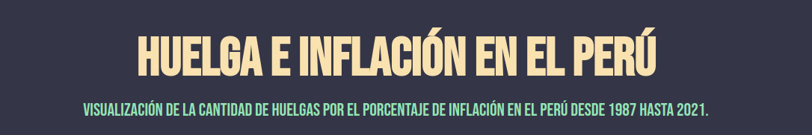

<div align="center">


</div>

## Descripción

Proyecto de visualización de datos del Ministerio de Trabajo y Promoción del Empleo, **Cantidad de Huelgas por el porcentaje de Inflación en el Perú desde 1987 hasta 2021**.

## Empecemos

Sigue estos pasos para descargar el repositorio, instalar las dependencias y correr la aplicación.

## Pre - requisitos

Tener instalado node.js, el editor de codigo VS code, y git por supuesto. Si estas en un entorno UNIX podrías usar NVM (Node version manager) para descargar y utilizar una version específica de node.

- [GIT](https://git-scm.com/downloads) - Git
- [NVM](https://github.com/nvm-sh/nvm) - Node version manager
- [VScode](https://code.visualstudio.com/) - Visual Studio Code

## Descarga

1. Clona el repositorio:

```
git clone https://github.com/BJChavez/huelgasjs.git
```

2. Ahora necesitamos instalar todos los paquetes y dependencias necesarias. En el mismo directorio y ejecutamos:

```
npm install
```

3. Corremos la aplicación:

```
npm run dev
```

4. Abrimos en el navegador:

```
http://localhost:5173/
```

## Tecnologías

- [Chart.js](https://www.chartjs.org/) - Simple yet flexible JavaScript charting library for the modern web
- [Tailwindcss](https://tailwindcss.com/) - Rapidly build modern websites without ever leaving your HTML
- [ESlint](https://eslint.org/) - Find and fix problems in your JavaScript code

### Autores

- [Joel Chavez](https://github.com/BJChavez) - **Principal**

## Datos

Los datos utilizados fueron descargados de la [Plataforma de datos abiertos](https://www.datosabiertos.gob.pe/) del Estado Peruano y de la página oficial de datos abiertos del [Banco Mundial](https://datos.bancomundial.org/).

## Licencia

Este proyecto tiene una licencia GPL. Mas detalle en [LICENSE.txt](LICENSE.txt)
